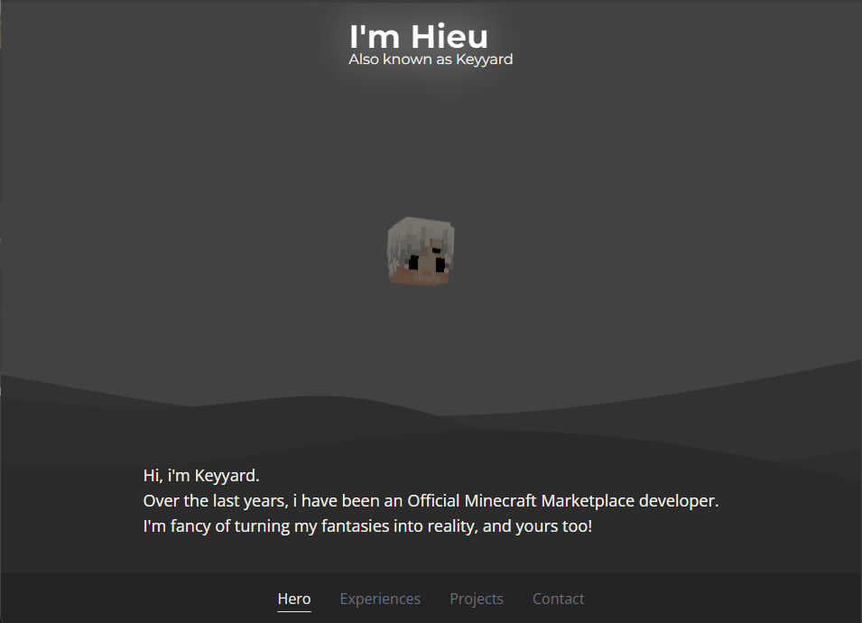

# Keyyard Portfolio

Welcome to the Keyyard Portfolio project! This is my personal portfolio website showcasing the work as an Official Minecraft Marketplace developer.

## Table of Contents

- [Live Website](lLive-website)
- [Features](#features)
- [Technologies Used](#technologies-used)
- [Contributing](#contributing)
- [License](#license)

## Live Website

You can view the live portfolio at [https://keyyard.github.io](https://keyyard.github.io).

## Features

- Interactive 3D head
- Smooth scrolling and animations
- Responsive design
- Email integration
- ...

## Technologies Used

- **React**: JavaScript library for building user interfaces
- **Three.js**: JavaScript 3D library
- **Framer Motion**: Library for animations
- **Tailwind CSS**: Utility-first CSS framework
- **Vite**: Next-generation frontend tooling
- **EmailJS**: Service to send emails directly from JavaScript
- **React Hot Toast**: Notifications for React
- ...

## Contributing

Contributions are welcome! Please open an issue or submit a pull request for any bugs or feature requests.

## License

This project is licensed under the MIT License. See the [LICENSE](LICENSE) file for details.
