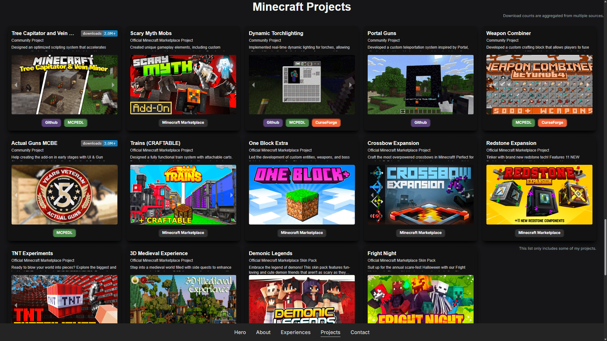

# Keyyard Portfolio

Welcome to the **Keyyard Portfolio** project! This is my personal portfolio website, showcasing my work as an Official Minecraft Marketplace developer. The site highlights my expertise in game development, programming, and creative design.

## Table of Contents

- [Live Website](#live-website)
- [About the Project](#about-the-project)
- [Features](#features)
- [Tech Stack](#tech-stack)
- [Getting Started](#getting-started)
- [Contributing](#contributing)
- [License](#license)

## Live Website

Check out the Official Website - Portfolio at: [https://keyyard.xyz](https://keyyard.xyz).

## About the Project

This portfolio showcases my journey as a developer specializing in **Minecraft Add-on Development**, **Web Development**, and **Native Development**. It features interactive 3D elements, smooth animations, and a modern design to deliver an engaging user experience. The portfolio also highlights my technical skills, projects, and collaborations with notable clients like **PrestonPlayz** and other Official Minecraft Marketplace projects.

## Features

- **Interactive 3D Background Waves**: Dynamic wave animations built with `Three.js` and `Canvas`, responsive to user interactions.
- **Interactive 3D Avatar**: A fully interactive 3D model of my Minecraft avatar that reacts to user input.
- **Smooth Scrolling and Animations**: Enhanced navigation and animations powered by `Framer Motion`.
- **Responsive Design**: Optimized for desktop, tablet, and mobile devices.
- **Email Integration**: Contact form powered by `EmailJS` for seamless communication.
- **Project Showcase**: Detailed project displays with links, images, and descriptions.
- **Modern UI/UX**: Clean, intuitive design using `Tailwind CSS`.

## Tech Stack

### Web Development

- **Frontend**: React, Vanilla JavaScript
- **Backend**: FastAPI, Flask, Next.js, Prisma ORM
- **Databases**: PostgreSQL, SQLite, JSON

### Styling

- **Tailwind CSS**: Utility-first CSS framework
- **Bootstrap**: Additional styling framework

### 3D and Animations

- **Three.js**: JavaScript library for 3D graphics
- **Framer Motion**: Library for animations and transitions

### Tools and Utilities

- **Vite**: Modern frontend build tool
- **Google Analytics**: Website performance tracking
- **GitHub Actions**: CI/CD for automated deployment with Vercel

### Programming Languages

- TypeScript, JavaScript

## Inspired?

Feel free to explore the code and contribute! If you like the project, consider giving it a star ⭐️ on GitHub. It means a lot to me!
